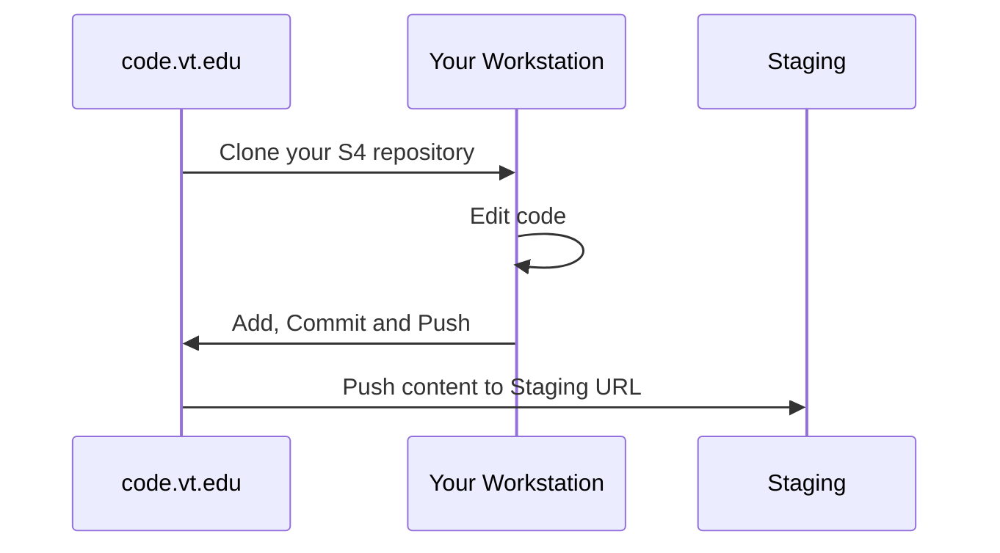
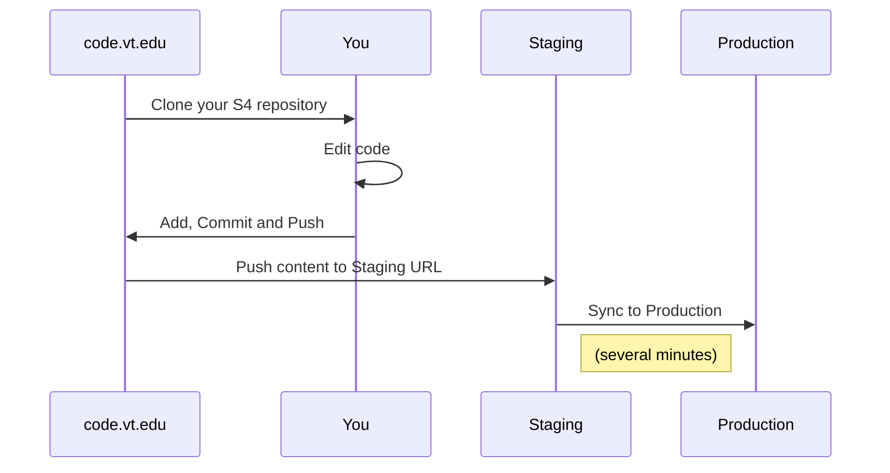

# Static Web Hosting for sailbot.aoe.vt.edu

## Welcome to the new S4 Service

> Where you will use git to hold your website files.
> The link below, labeled "stage site", is where you will initially view your website.

##### STAGE Site URL: [http://sailbot.aoe.vt.edu.s3-website-us-east-1.amazonaws.com](http://sailbot.aoe.vt.edu.s3-website-us-east-1.amazonaws.com)

### How S4 Works (Staged Site) 

### Getting Started 

### [Instructions](https://s4docs.hosting.vt.edu) (under construction)

Please give feedback, and let us know what we can do to make this easier for you.

  * Use the stage site url link above to see results of any file changes.
  
  * Git Instructions/Tutorials 
    * (https://medium.com/@taylorwan/git-for-dummies-63d0c85a239)
    * (https://thenewstack.io/tutorial-git-for-absolutely-everyone/)
    * (https://medium.com/@taylorwan/git-for-dummies-63d0c85a239)

### How to Launch Your Site
> When you are ready to let the public view your site, you will need to submit a ticket here: [Web Hosting Support](https://webapps.es.vt.edu/support/)
>
> Launch days are on Tuesday and Thursday afternoons between 1 and 4pm.

### How S4 Works   (Launched Site) 

